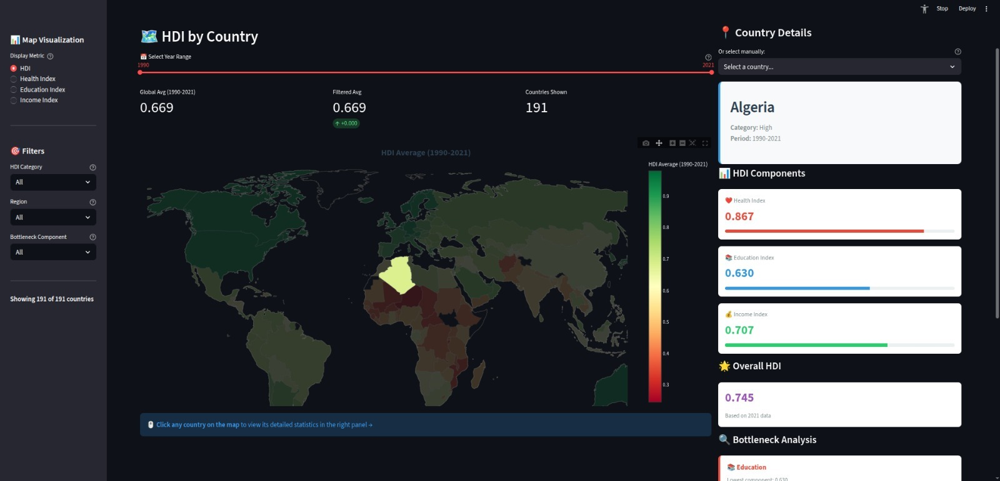

# HDI Explorer - Human Development Index Interactive Visualization

## Project Overview

An interactive web application for exploring the Human Development Index (HDI) dataset, focusing on visualizing the impact of the three core components of HDI (Health, Education, and Income) across different countries. The tool provides clustering capabilities to identify patterns and bottlenecks in human development across regions.




## Project Objectives

- **Interactive Map Visualization**: Navigate through countries with an interactive world map
- **Component Analysis**: Visualize how the three HDI components (Life Expectancy, Education, GNI per capita) impact each country
- **Clustering Insights**: Identify groups of countries with similar development patterns
- **Bottleneck Identification**: Discover which components are limiting factors for different regions
- **Clean Dashboard**: Simple, focused interface showing country-specific statistics

## Tech Stack

### Core Framework
- **Streamlit** - Python web framework for rapid data app development
  - Pros: Python-native, easy to prototype, built-in interactive widgets
  - Perfect for data science projects with minimal frontend overhead

### Data Processing
- **Pandas** - Data manipulation and analysis
- **NumPy** - Numerical computations
- **Scikit-learn** - Clustering algorithms (K-Means, DBSCAN, Hierarchical)

### Visualization Libraries
- **Plotly** - Interactive charts and graphs
  - Choropleth maps for geographic visualization
  - Scatter plots, bar charts, radar charts for component analysis
  - 3D scatter plots for clustering visualization
- **Plotly Express** - High-level plotting interface
- **Matplotlib/Seaborn** (optional) - Additional statistical visualizations

### Additional Tools
- **PyYAML** - Configuration management
- **Streamlit-Folium** (optional) - If we need advanced map interactions

## Project Structure

```
data-vis-project/
│
├── README.md                      # Project documentation
├── requirements.txt               # Python dependencies
├── .gitignore                     # Git ignore file
│
├── app.py                         # Main Streamlit application entry point
│
├── data/                          # Data directory
│   ├── raw/                       # Original HDI datasets
│   ├── processed/                 # Cleaned and processed data
│   └── README.md                  # Data documentation
│
├── src/                           # Source code modules
│   ├── __init__.py
│   │
│   ├── data_processing.py         # Data loading, cleaning, and preprocessing
│   │   ├── load_hdi_data()
│   │   ├── clean_data()
│   │   └── calculate_hdi_components()
│   │
│   ├── clustering.py              # Clustering algorithms and analysis
│   │   ├── perform_kmeans()
│   │   ├── perform_hierarchical()
│   │   ├── determine_optimal_clusters()
│   │   └── analyze_cluster_characteristics()
│   │
│   ├── visualizations.py          # Visualization components
│   │   ├── create_choropleth_map()
│   │   ├── create_component_chart()
│   │   ├── create_radar_chart()
│   │   ├── create_cluster_scatter()
│   │   └── create_time_series()
│   │
│   └── utils.py                   # Utility functions
│       ├── get_country_info()
│       ├── calculate_statistics()
│       └── format_display_data()
│
├── config/                        # Configuration files
│   ├── app_config.yaml            # Application settings
│   └── visualization_config.yaml  # Visualization themes and settings
│
├── assets/                        # Static assets
│   ├── styles/                    # Custom CSS
│   └── images/                    # Logos, icons
│
└── tests/                         # Unit tests (optional)
    ├── __init__.py
    ├── test_data_processing.py
    ├── test_clustering.py
    └── test_visualizations.py
```

## How the Code Works

### Architecture Overview

The application follows a modular architecture with clear separation of concerns:

```
Raw Data → Data Processing → Processed Data → Streamlit App → User Interface
                ↓                    ↓              ↓
           Calculations         Storage      Visualizations
```

### 1. Data Processing Pipeline (`src/data_processing.py`)

#### **Step 1: Data Loading (`load_hdi_data()`)**
```python
df = pd.read_csv("data/raw/data-raw.csv")
# Result: 195 countries × 880 columns
```
- Loads the raw CSV containing HDI data from 1990-2021
- Includes all components: HDI scores, life expectancy, education metrics, GNI

#### **Step 2: Data Cleaning (`clean_data()`)**
```python
# Converts string columns to numeric
df['HDI (2021)'] = pd.to_numeric(df['HDI (2021)'], errors='coerce')

# Handles missing values marked as ".." in the dataset
# Removes aggregate regions (e.g., "Arab States", "World")
```
**Purpose**: Ensure all data is in the correct format for calculations

#### **Step 3: Component Calculation (`calculate_hdi_components()`)**

This is the **core function** that implements the UNDP HDI methodology:

**A) Health Index (Life Expectancy)**
```python
Health_Index = (Life_Expectancy - 20) / (85 - 20)
```
- **Input**: Life expectancy at birth (years)
- **Range**: [20, 85] years → normalized to [0, 1]
- **Example**: 70 years → (70-20)/(85-20) = 0.769

**B) Education Index**
```python
# Two sub-indices:
Mean_School_Index = Mean_Years_Schooling / 18
Expected_School_Index = Expected_Years_Schooling / 18

# Combined:
Education_Index = (Mean_School_Index + Expected_School_Index) / 2
```
- **Mean Years**: Average years of schooling for adults 25+
- **Expected Years**: Years a child is expected to receive
- **Maximum**: 18 years for both

**C) Income Index (GNI per capita)**
```python
Income_Index = (ln(GNI) - ln(100)) / (ln(75000) - ln(100))
```
- **Input**: Gross National Income per capita in PPP $
- **Logarithmic transformation**: Reflects diminishing returns of income
- **Range**: [100, 75000] USD → normalized to [0, 1]

**D) HDI Calculation (Geometric Mean)**
```python
HDI = (Health_Index × Education_Index × Income_Index)^(1/3)
```
- **Why geometric mean?**: Ensures balanced development
- If any component is 0, the entire HDI becomes 0
- Countries must improve all dimensions, not just one

**E) Bottleneck Identification**
```python
# Find the minimum component for each country
bottleneck = min(Health_Index, Education_Index, Income_Index)

# Example: Afghanistan
Health_Index = 0.65
Education_Index = 0.35  ← Bottleneck!
Income_Index = 0.45
```
**Insight**: Shows which dimension is holding back a country's development

#### **Step 4: Time Series Extraction (`extract_time_series()`)**
```python
# Extracts columns like:
# "Human Development Index (1990)", ..., "Human Development Index (2021)"
# Creates separate DataFrames for HDI, Life Expectancy, Education, GNI
```
**Purpose**: Enable historical trend analysis

#### **Step 5: Data Storage**
Saves multiple processed files:
- `hdi_components.csv` - Main dataset with all calculations
- `clustering_data.csv` - Only the 3 indices for clustering
- `timeseries_*.csv` - Historical data for each metric

---

### 2. Visualization Module (`src/visualizations.py`)

#### **Choropleth Map (`create_choropleth_map()`)**
```python
fig = go.Figure(data=go.Choropleth(
    locations=df['ISO3'],  # ISO 3-letter country codes
    z=df['HDI'],           # Values to color by
    colorscale='RdYlGn',   # Red → Yellow → Green
    ...
))
```
**How it works**:
1. Uses ISO3 codes to match countries to geographic shapes
2. Maps HDI values to colors (Red = low, Green = high)
3. Adds hover tooltips and interactivity
4. Plotly handles the geographic projection

**Color Scales**:
- HDI: Red-Yellow-Green (intuitive good/bad)
- Health: Red gradient (health intensity)
- Education: Blue gradient (knowledge theme)
- Income: Green gradient (money association)

#### **Component Breakdown Chart (`create_component_breakdown_chart()`)**
```python
# Bar chart showing the 3 indices side-by-side
components = ['Health', 'Education', 'Income']
values = [0.85, 0.92, 0.78]
```
**Purpose**: Quick visual comparison of a country's strengths/weaknesses

#### **Other Visualizations**
- **Radar Chart**: Spider plot comparing countries
- **Time Series**: Line graphs showing evolution over time
- **3D Scatter**: Clustering results in 3D component space
- **Bottleneck Bar Chart**: Distribution of limiting factors

---

### 3. Utility Module (`src/utils.py`)

**Helper functions that support the main application:**

#### **Data Loading (`load_processed_data()`)**
```python
data = {
    'components': pd.read_csv('hdi_components.csv'),
    'clustering': pd.read_csv('clustering_data.csv'),
    'timeseries': {
        'hdi': pd.read_csv('timeseries_hdi.csv'),
        ...
    }
}
```
**Uses Streamlit's `@st.cache_data`** to load files only once

#### **Year Range Filtering (`get_year_columns()`, `calculate_mean_for_years()`)**
```python
# Get columns for years 2010-2020
year_cols = get_year_columns(df, start_year=2010, end_year=2020)

# Calculate mean HDI across those years
mean_df = df[year_cols].mean(axis=1)
```
**Purpose**: Powers the year range slider functionality

#### **Country Lookup (`get_country_info()`)**
```python
# Find by name or ISO3 code
country_data = df[df['Country'] == 'Switzerland']
# Returns: All HDI data for Switzerland
```

---

### 4. Main Application (`app.py`)

#### **Streamlit Architecture**

**A) Page Configuration**
```python
st.set_page_config(
    page_title="HDI Explorer",
    layout="wide",  # Full width
    ...
)
```

**B) Data Loading with Caching**
```python
@st.cache_data  # ← Caches result, loads once
def load_data():
    return load_processed_data()
```
**Benefit**: Instant subsequent page loads

**C) Sidebar Filters**
```python
selected_category = st.sidebar.selectbox("HDI Category", categories)
selected_region = st.sidebar.selectbox("Region", regions)
selected_bottleneck = st.sidebar.selectbox("Bottleneck", bottlenecks)
```
**Creates dropdown menus** for filtering

**D) Dynamic Filtering Logic**
```python
filtered_df = components_df.copy()

if selected_category != 'All':
    filtered_df = filtered_df[filtered_df['HDI_Category'] == selected_category]

if selected_region != 'All':
    filtered_df = filtered_df[filtered_df['Region'] == selected_region]
```
**Real-time filtering**: Changes immediately update the visualization

**E) Year Range Slider**
```python
year_range = st.sidebar.slider(
    "Select Year Range",
    min_value=1990,
    max_value=2021,
    value=(1990, 2021)  # Default: all years
)

# Calculate mean HDI for selected range
mean_hdi = timeseries_df[year_cols].mean(axis=1)
```
**Interactive**: Drag slider ends to adjust range

**F) Map Rendering**
```python
fig = create_choropleth_map(
    filtered_df,
    value_column='HDI',
    title='Human Development Index by Country'
)

st.plotly_chart(fig, use_container_width=True)
```
**Plotly integration**: Streamlit displays interactive Plotly charts

**G) Reactive Updates**
```
User changes filter → filtered_df updates → map re-renders → statistics recalculate
```
**Everything happens automatically** - Streamlit re-runs the script on each interaction

---

### 5. Data Flow Example

**User Action**: "Show me Sub-Saharan African countries with Education bottlenecks"

```python
# 1. User selects filters
Region = "SSA"
Bottleneck = "Education"

# 2. Data filtering
df_filtered = df[df['Region'] == 'SSA']
df_filtered = df_filtered[df_filtered['Bottleneck_Component'] == 'Education']
# Result: 25 countries

# 3. Map creation
fig = create_choropleth_map(df_filtered, value_column='Education_Index')
# Colors SSA countries by their education index

# 4. Statistics calculation
avg_education = df_filtered['Education_Index'].mean()  # e.g., 0.52

# 5. Display
st.plotly_chart(fig)  # Shows map
st.metric("Avg Education Index", f"{avg_education:.3f}")  # Shows 0.520
```

---

### 6. Key Algorithms

#### **Bottleneck Detection Algorithm**
```python
def identify_bottleneck(health_idx, education_idx, income_idx):
    """
    Returns which component is lowest (the bottleneck)
    """
    components = {
        'Health': health_idx,
        'Education': education_idx,
        'Income': income_idx
    }
    
    bottleneck = min(components, key=components.get)
    return bottleneck
```

**Why this matters**:
- **Policy insight**: Countries should focus on their bottleneck
- **Resource allocation**: Improving the bottleneck has the highest impact
- **Development strategy**: Balanced improvement is better than focusing on already-strong areas

#### **Year Range Mean Calculation**
```python
def calculate_mean_for_years(df, year_columns):
    """
    Calculates average HDI across multiple years for each country
    """
    # year_columns = ['HDI (2010)', 'HDI (2011)', ..., 'HDI (2020)']
    
    result = df[['ISO3', 'Country']].copy()
    result['Mean_Value'] = df[year_columns].mean(axis=1)
    
    return result
```

**Use case**: Compare average development levels across different time periods

---

### 7. Performance Optimizations

**1. Caching**
```python
@st.cache_data
def load_data():
    # Only loads once, then cached
```
**Benefit**: Instant subsequent loads

**2. Lazy Loading**
```python
# Only loads time series when needed
if year_range_enabled:
    timeseries_data = load_timeseries()
```

**3. Efficient Filtering**
```python
# Pandas boolean indexing (very fast)
filtered_df = df[df['HDI_Category'] == 'Very High']
```

---

### 8. Mathematical Formulas Explained

#### **Why Geometric Mean for HDI?**
```
Arithmetic Mean: (0.9 + 0.9 + 0.1) / 3 = 0.63
Geometric Mean:  (0.9 × 0.9 × 0.1)^(1/3) = 0.44
```

**Implication**: A country with one very low component gets a lower HDI
**Policy message**: Can't compensate for poor health with high income

#### **Why Logarithm for Income?**
```
GNI = $1,000  → Income_Index = 0.40
GNI = $10,000 → Income_Index = 0.74
GNI = $100,000 → Income_Index = 1.00
```

**Reason**: Diminishing returns - going from $1k to $10k improves life more than $50k to $60k

---

## Key Features to Implement

### 1. Interactive Map (Left Panel)
- Choropleth map showing HDI values by country
- Color gradient based on HDI score
- Click interaction to select countries
- Hover tooltips with basic information
- Filter by HDI categories (Very High, High, Medium, Low)

### 2. Dashboard (Right Panel)
When a country is selected:
- **Country Overview**: HDI score, rank, and category
- **Component Breakdown**: Visual breakdown of the three components
  - Life Expectancy Index
  - Education Index (mean + expected years)
  - GNI per capita Index
- **Radar Chart**: Compare country against regional/global averages
- **Bottleneck Analysis**: Identify which component is the limiting factor
- **Historical Trends**: Time series of HDI evolution

### 3. Clustering Analysis
- **Cluster View**: Toggle to show countries grouped by similarity
- **Algorithm Selection**: K-Means, Hierarchical, or DBSCAN
- **Number of Clusters**: Interactive slider
- **3D Scatter Plot**: Visualize countries in 3-dimensional space (3 HDI components)
- **Cluster Characteristics**: Summary statistics for each cluster
- **Bottleneck Patterns**: Identify common bottlenecks within clusters

## HDI Components

The Human Development Index is calculated from three dimensions:

1. **Health** - Life Expectancy at Birth
2. **Education** - 
   - Mean Years of Schooling
   - Expected Years of Schooling
3. **Standard of Living** - GNI per capita (PPP $)

Formula: HDI = (Health Index × Education Index × Income Index)^(1/3)

## Development Phases

### Phase 1: Setup & Data Processing ✅ COMPLETED
- [x] Set up development environment
- [x] Install dependencies
- [x] Load and explore HDI dataset
- [x] Clean and preprocess data
- [x] Calculate component contributions
- [x] Implement bottleneck detection algorithm
- [x] Extract time series data (1990-2021)
- [x] Save processed data to multiple CSV files

### Phase 2: Basic Visualization ✅ COMPLETED
- [x] Create basic Streamlit app structure
- [x] Implement choropleth map with Plotly
- [x] Add sidebar filters (Category, Region, Bottleneck)
- [x] Build dashboard layout with metrics
- [x] Add year range slider with mean calculation
- [x] Implement real-time filtering
- [x] Create bottleneck distribution chart
- [x] Add data table view

### Phase 3: Component Analysis 🔄 IN PROGRESS
- [x] Implement component breakdown visualizations
- [x] Build bottleneck identification logic
- [ ] Create radar charts for country comparison
- [ ] Add historical trend visualizations for individual countries
- [ ] Implement country detail page

### Phase 4: Clustering 📋 PLANNED
- [ ] Implement K-Means clustering
- [ ] Implement Hierarchical clustering
- [ ] Create cluster visualization (3D scatter)
- [ ] Add cluster selection and filtering
- [ ] Analyze and display cluster characteristics
- [ ] Show common bottlenecks within clusters

### Phase 5: Polish & Refinement 📋 PLANNED
- [x] Add custom styling with CSS
- [x] Implement data caching for performance
- [x] Write comprehensive documentation
- [ ] Add country-to-country comparison feature
- [ ] Export functionality for filtered data
- [ ] Add more interactive tooltips
- [ ] Comprehensive testing

## Getting Started

### Prerequisites
- Python 3.8+
- pip or conda package manager

### Installation
```bash
# Create virtual environment
python -m venv venv

# Activate virtual environment
# On Linux/Mac:
source venv/bin/activate
# On Windows:
venv\Scripts\activate

# Install dependencies
pip install -r requirements.txt
```

### Running the Application
```bash
streamlit run app.py
```

The application will open in your default browser at `http://localhost:8501`

## Data Source

- **Primary Source**: United Nations Development Programme (UNDP)
- **Dataset**: Human Development Reports
- **URL**: http://hdr.undp.org/en/data

## Team Contributions

[Add team member names and responsibilities here]

## License

[Specify license for educational project]

## Acknowledgments

- UNDP for providing the HDI dataset
- Data Visualization course instructors

---

**Last Updated**: October 6, 2025

